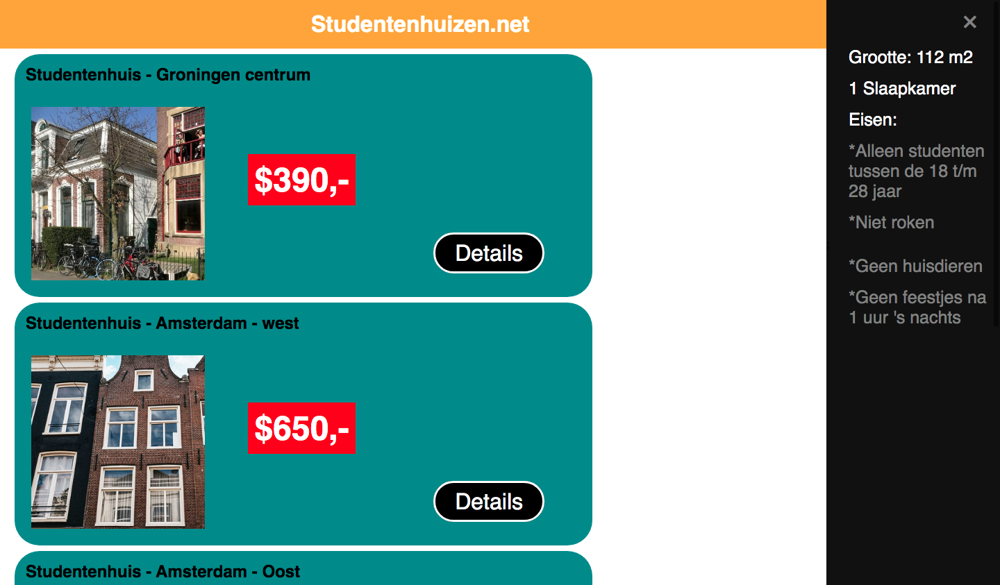

# Frontend voor Designers - opdracht 1: Een Micro-interactie uitwerken en testen

Ontwerp een user interface voor een gegeven use case. Werk je ontwerp uit in HTML, CSS en Javascript om te kunnen testen in een browser.

Lees hier de [opdrachtbeschrijving](./opdrachtbeschrijving.md).

# Project titel : Studentenhuizen.net

In een lijst studentenhuizen wil ik details kunnen bekijken om 
te bepalen of de kamer geschikt is om te huren.

Link demo:https://stijnvisser.github.io/frontend-voor-designers-2021/opdracht1/Studentenhuizen_site/

## interface
Leg de interface uit. In de demo heb je de interface design principles 04 & 11 van [Principles of User Interface Design](http://bokardo.com/principles-of-user-interface-design/) toegepast. Hoe heb je dat gedaan?

De principes Keep users & Strong visual hierachy heb ik toegepast, doormiddel door de knoppen extra groot en duidelijk te maken.
Daarnaast heb ik voor de hierachy een duidelijk onderscheid gemaakt in kleur gebruik voor de verschillende onderwerpen zoals, prijs en de detail knop. 

## code
Voor opdracht 1 heb ik een site gemaakt waar een lijst van beschikbare studentenhuizen op te zien is.

Door op de detail knop te drukken komt rechts van het scherm een extra venster waar je deze detail kan bekijken.
Dit heb ik doormiddel van een sidenavigation gemaakt. Door deze sidenavigation een z-index en een overflow:hidden; mee te geven kan je er voor zorgen dat dit venster het scherm in komt wanneer je op een bepaalde knop drukt. Dit moet je dan nog wel even met javascript programmeren.

Versie 1

Versie 2

Bij de tweede versie van mijn site heeft elke woning een eigen side-navigation waarop de data van de betreffende woning te zien is.

Daarnaast is elke woning voorzien van een aparte kleur zodat het onderscheid onder de verschillende woningen duidelijker is.

