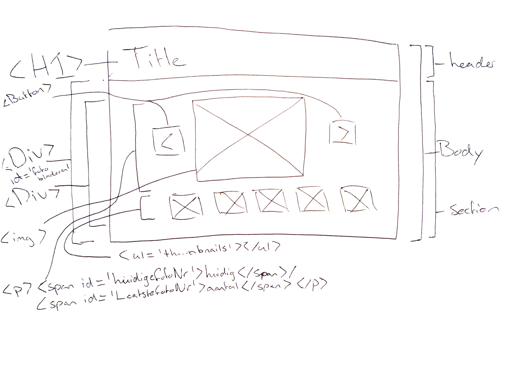
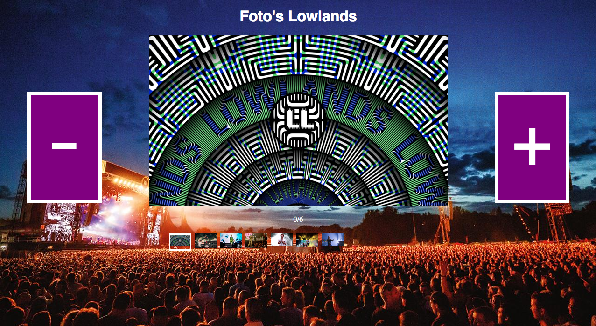
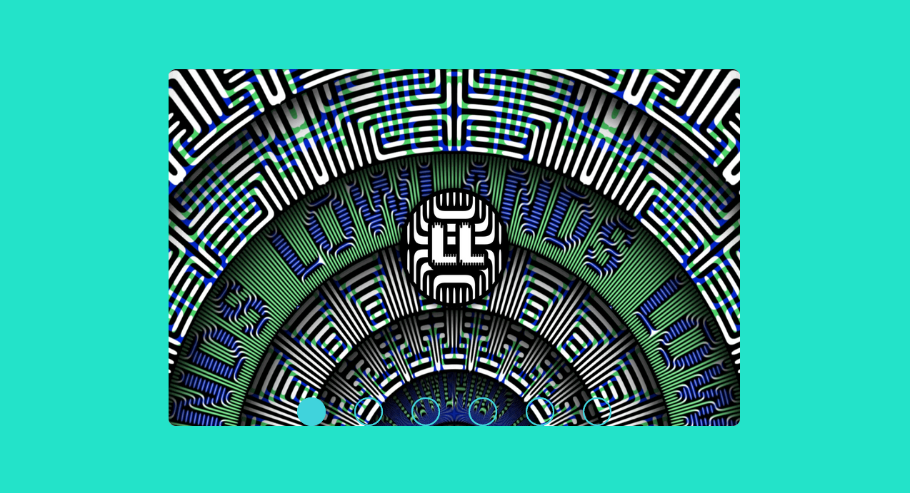

# Frontend voor Designers - opdracht 2: Een interactie uitwerken voor verschillende gebruikers input

Werk een functionaliteit uit die je kunt bedienen met 'click' en nog een user interactie, zoals het toetsenbord, tab, dubbel click, swipe, long press, <del>force touch</del>, of iets anders ... Werk je ontwerp uit in HTML, CSS en Javascript om te kunnen testen in een [browser](https://en.m.wikipedia.org/wiki/List_of_web_browsers).

Lees hier de [opdrachtbeschrijving](./opdrachtbeschrijving.md).

# Project titel
Bij dit project, opdracht2, heb ik een fotopagina van lowlands gemaakt waarbij verschillende artiesten te zien zijn.

Door op de buttons te klikken navigeer je door de foto's.

Link: https://stijnvisser.github.io/frontend-voor-designers-2021/opdracht2/demo/

## interface
Breakdownschets:

versie 1:

Leg de interface uit.

versie 2:

Leg de interface uit:

Bij de tweede versie ben ik helemaal opnieuw begonnen met mijn code en heb ik mij gefocused op css transities. 

Ik heb geprobeerd om in css animaties te maken om dit vervolgens uit te laten voeren in Javascript.

In de demo heb je interface design principles 04, 08 & 09 van [Principles of User Interface Design](http://bokardo.com/principles-of-user-interface-design/) toegepast. Hoe heb je dat gedaan?

Ik heb het principe: Keep users in control uit laten voeren 

In de demo heb je meerdere [UI events](https://developer.mozilla.org/en-US/docs/Web/API/UIEvent) toegepast. Hoe heb je dat gedaan?

## code
Leg de code uit.
